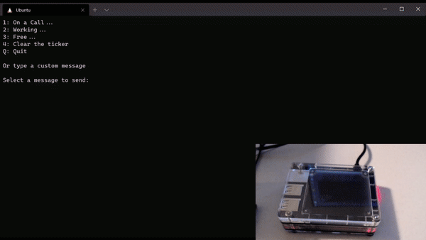

# pi-ticker

I started this project because I've been working from home for the past 2 months and there
really is no end in sight with the pandemic happening. I'm working in my basement and the
rest of my family can't always tell when I'm on a Zoom call, so they tip-toe around just in case. I wanted a way to let them know
when I am on a call or just working and I had a [Raspberry Pi](https://www.raspberrypi.org/) with
a [Unicorn HAT HD](https://shop.pimoroni.com/products/unicorn-hat-hd) from an earlier project.

For now, I am updating the message manually. Eventually, I'd like to use either the Outlook
API or the Zoom API to determine when I'm in a call.

**ticker.py** - a headless service that subscribes to an MQTT topic and displays messages on a Unicorn HAT HD.

**ticker-client.py** - a client application that sends messages to an MQTT topic which are then displayed by the ticker service.

**settings.yml** - used by both of the scripts above. Add your
MQTT server address.

This service requires an MQTT server like [Mosquitto](http://mosquitto.org/). You can run it on the Raspberry Pi itself or on another computer you have on your network.

There's various ways to make the ticker.py script run when the Pi boots up. Systemd, Docker, auto-login and run the script in the `.bashrc`. For now, I'm using the latter as it's quick and easy. I may dockerize it in the future.
